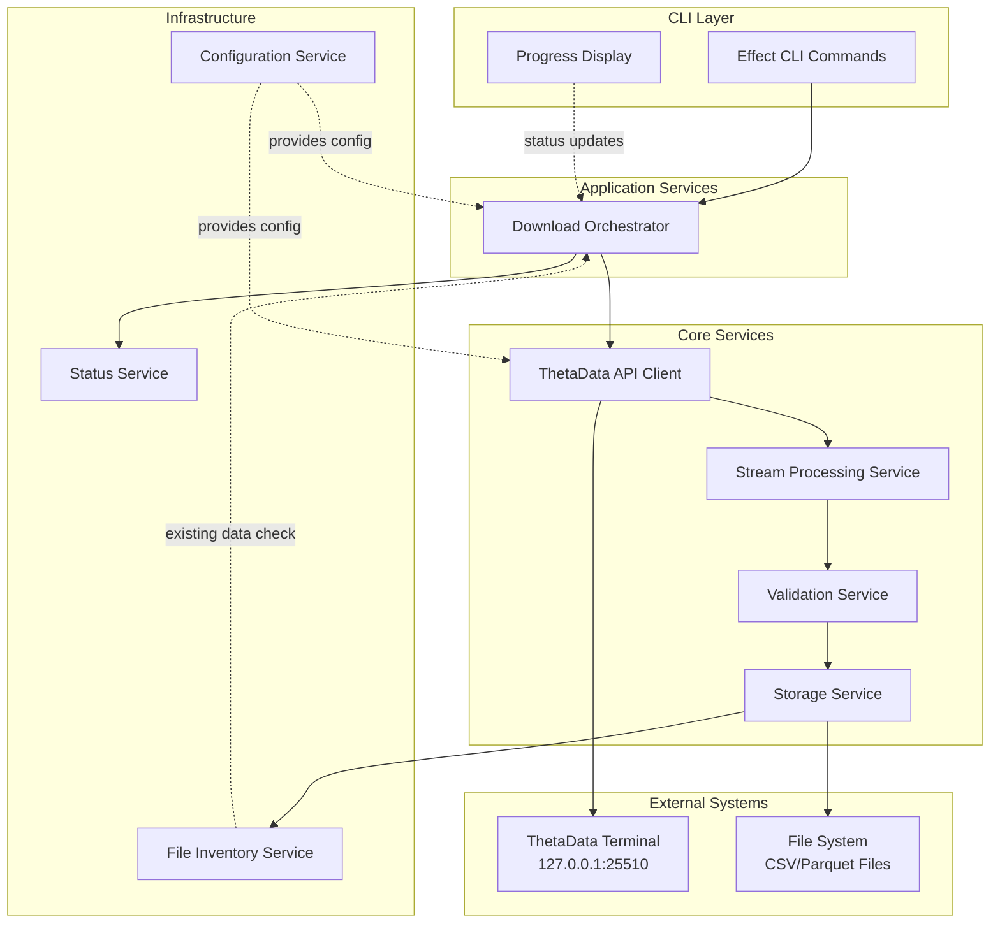
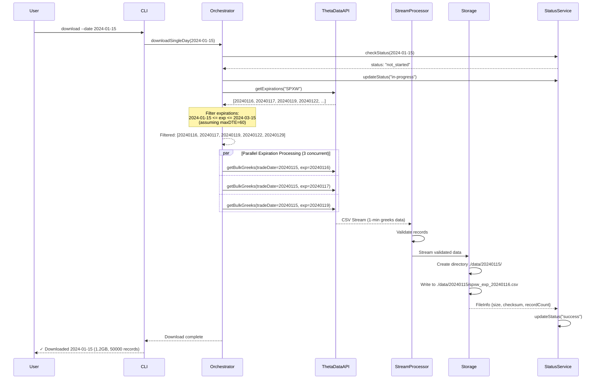
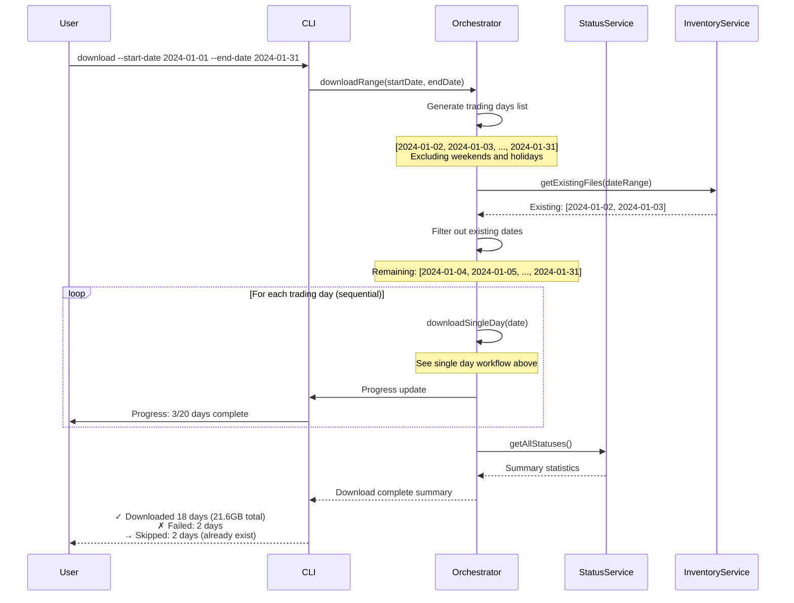
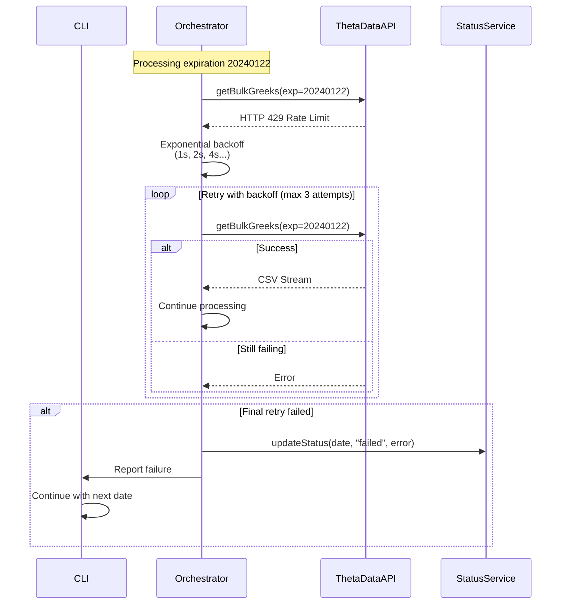
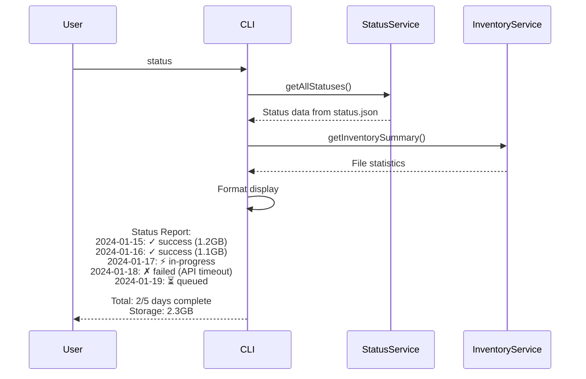
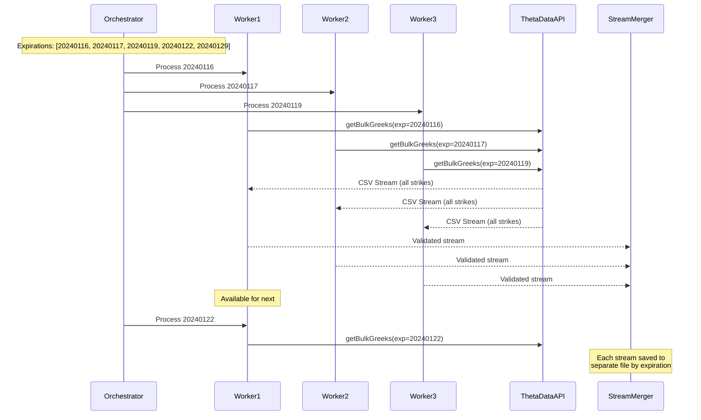

# SPX Options Data Pipeline Tool Architecture Document

## Introduction

### Introduction Content

This document outlines the overall project architecture for SPX Options Data Pipeline Tool, including backend systems, shared services, and non-UI specific concerns. Its primary goal is to serve as the guiding architectural blueprint for AI-driven development, ensuring consistency and adherence to chosen patterns and technologies.

**Relationship to Frontend Architecture:**
If the project includes a significant user interface, a separate Frontend Architecture Document will detail the frontend-specific design and MUST be used in conjunction with this document. Core technology stack choices documented herein (see "Tech Stack") are definitive for the entire project, including any frontend components.

### Starter Template or Existing Project

N/A - No starter template detected. Given the comprehensive Effect-TS patterns document, we'll build from scratch following established patterns with Bun runtime.

### Change Log

| Date | Version | Description | Author |
|------|---------|-------------|---------|
| 2025-08-05 | 1.0 | Initial architecture document | Winston (Architect) |

## High Level Architecture

### Technical Summary

The SPX Options Data Pipeline Tool will be built as a streaming CLI application using Effect-TS with Bun runtime, implementing a service-oriented architecture with expiration-based parallelization. The system processes SPX options data from ThetaData's local terminal API through memory-efficient Effect Streams, validates data integrity, and stores results as compressed Parquet files. Core architectural patterns include Context.Tag-based dependency injection, tagged error handling, and comprehensive test layers following strict TDD practices.

### High Level Overview

**Architectural Style:** Service-Oriented CLI Application with Streaming Pipeline

**Repository Structure:** Monorepo (as specified in PRD)
- Single repository containing all modules with clear separation
- `/packages/core` - Core business logic and services
- `/packages/cli` - CLI commands and interface
- `/packages/api-client` - ThetaData API integration

**Service Architecture:** Effect-TS Service Layer Architecture
- Context.Tag for service identification
- Layer composition for dependency injection
- Separate Live and Test implementations for all services
- Tagged errors for type-safe error handling

**Primary Data Flow:**
1. CLI command triggers download for date range
2. ThetaDataApiClient fetches available SPXW expirations
3. Filter expirations by trade date + maxDTE configuration
4. Parallel requests for bulk greeks data (2-4 concurrent)
5. Stream pipeline processes CSV data with <75% memory usage
6. ValidationService ensures data integrity
7. StorageService writes to trade date directories
8. Progress tracking provides real-time feedback

**Key Architectural Decisions:**
- **Bun over Node.js** - Better performance, native SQLite support, faster startup
- **Effect Streams** - Memory-efficient processing of 50K+ records/minute
- **Expiration-based parallelization** - Optimal balance between speed and API limits
- **Parquet storage** - 5:1 compression ratio and 10x query performance
- **Service layer pattern** - Clean separation of concerns and testability

### High Level Project Diagram



### Architectural and Design Patterns

- **Service-Oriented Architecture (Effect-TS):** Using Context.Tag pattern for all services with Layer composition - *Rationale:* Enforces clean separation of concerns, enables dependency injection, and simplifies testing with Test layers
- **Streaming Pipeline Pattern:** Effect Streams for continuous data processing - *Rationale:* Prevents memory overflow when processing years of data, handles 50K+ records/minute efficiently
- **Expiration-Based Processing:** Parallel processing grouped by expiration dates - *Rationale:* Simplifies architecture while maximizing throughput within API rate limits
- **Command Pattern (Effect CLI):** Structured CLI commands with Options and Args - *Rationale:* Provides intuitive interface for quant researchers, supports complex operations with simple commands
- **Repository Pattern:** Abstract data access for file operations - *Rationale:* Enables testing with in-memory implementations and future storage flexibility
- **Circuit Breaker Pattern:** For ThetaData API resilience - *Rationale:* Prevents cascading failures and manages API availability gracefully
- **Dependency Injection (Effect Layers):** Layer composition for all dependencies - *Rationale:* Facilitates testing, configuration management, and environment-specific implementations

## Tech Stack

### Cloud Infrastructure
- **Provider:** Local/On-premise (ThetaData runs locally)
- **Key Services:** File system storage only for MVP
- **Deployment Regions:** N/A - Local deployment

### Technology Stack Table

| Category | Technology | Version | Purpose | Rationale |
|----------|------------|---------|---------|-----------|
| **Runtime** | Bun | 1.1.0 | JavaScript runtime | Faster than Node.js, native TypeScript support, aligns with Effect-TS patterns doc |
| **Language** | TypeScript | 5.3.3 | Primary development language | Type safety, Effect-TS requirement, team standard |
| **CLI Framework** | @effect/cli | 0.36.0 | Command-line interface | Native Effect integration, type-safe commands, from patterns doc |
| **HTTP Client** | @effect/platform-bun | 0.36.0 | API communication | Bun-optimized, Effect native, built-in retry support |
| **CSV Parser** | csv-parse | 5.5.0 | CSV streaming parser | Memory efficient, streaming support, wide compatibility |
| **Testing** | @effect/vitest | 0.5.0 | Test framework | Effect-native testing, follows TDD requirement |
| **Build Tool** | Bun | 1.1.0 | Bundling and compilation | Native bundler, single binary output capability |
| **Config** | Effect Config | (built-in) | Configuration management | Type-safe, native Effect integration, env var support with defaults |
| **Schema Validation** | @effect/schema | 0.64.0 | Data validation | Effect-native validation, required for data integrity |
| **Date Library** | date-fns | 3.3.0 | Date manipulation | Trading day calculations, lightweight |
| **Logging** | @effect/platform | 0.36.0 | Structured logging | Effect-native, configurable levels |

## Data Models

### OptionData
**Purpose:** Represents a single SPX option contract data point from ThetaData

**Key Attributes:**
- **symbol**: string - The option symbol (e.g., "SPXW")
- **strike**: number - Strike price of the option
- **expiry**: Date - Expiration date of the contract
- **optionType**: "call" | "put" - Type of option
- **bid**: number - Current bid price
- **ask**: number - Current ask price
- **last**: number - Last traded price
- **volume**: number - Trading volume
- **openInterest**: number - Open interest
- **impliedVolatility**: number - Implied volatility
- **delta**: number - Option delta
- **gamma**: number - Option gamma
- **theta**: number - Option theta
- **vega**: number - Option vega
- **timestamp**: Date - When this data was captured

**Relationships:**
- Part of a DailyOptionsDataset (many options per day)
- Can be grouped by expiry date for options chains

### DailyOptionsDataset
**Purpose:** Represents all options data for a single trading day

**Key Attributes:**
- **date**: Date - Trading date
- **recordCount**: number - Total number of option records
- **fileSize**: number - Size of the data file in bytes
- **downloadedAt**: Date - When the data was downloaded
- **checksum**: string - SHA-256 hash for data integrity

**Relationships:**
- Contains many OptionData records
- Referenced by DownloadStatus for tracking

### DownloadStatus
**Purpose:** Tracks the download progress and status for each date

**Key Attributes:**
- **date**: Date - Trading date
- **status**: "queued" | "in-progress" | "success" | "failed" - Current status
- **startTime**: Date | null - When download started
- **endTime**: Date | null - When download completed
- **attempts**: number - Number of download attempts
- **error**: string | null - Error message if failed
- **recordCount**: number | null - Records downloaded (if successful)
- **fileSize**: string | null - Human-readable file size

**Relationships:**
- References a DailyOptionsDataset when successful
- Updated by the download orchestrator

### Configuration
**Purpose:** System configuration loaded from Effect Config

**Key Attributes:**
- **thetaData.baseUrl**: string - ThetaData terminal URL
- **download.maxDTE**: number - Maximum days to expiration filter
- **download.concurrentExpirations**: number - Max parallel requests
- **download.retryAttempts**: number - Max retry attempts
- **storage.dataDirectory**: string - Where to store files
- **storage.fileFormat**: "csv" | "parquet" - Output format

**Relationships:**
- Singleton configuration used by all services

### FileInfo
**Purpose:** Tracks stored data files in the inventory

**Key Attributes:**
- **tradeDate**: Date - Trade date (directory name)
- **expirationDate**: Date - Expiration date (part of filename)
- **filename**: string - Full filename (e.g., "spxw_exp_20240116.csv")
- **path**: string - Relative path (e.g., "./data/20240115/spxw_exp_20240116.csv")
- **size**: number - File size in bytes
- **checksum**: string - SHA-256 hash
- **createdAt**: Date - When file was created
- **format**: "csv" | "parquet" - File format

**Relationships:**
- Multiple files per trading day (one per expiration)
- Referenced by inventory service

## Components

### ThetaDataApiClient
**Responsibility:** Manages all communication with the ThetaData Terminal API

**Key Interfaces:**
- `getExpirations(root: string): Effect.Effect<string[], ApiError>`
- `getBulkGreeks(tradeDate: Date, expiration: string): Effect.Effect<Stream<OptionData>, ApiError>`
- `healthCheck(): Effect.Effect<boolean, never>`

**Dependencies:** 
- HttpClient from @effect/platform-bun
- ConfigService for API settings

**Technology Stack:** 
- @effect/platform-bun for HTTP requests
- Built-in retry logic with exponential backoff
- Rate limiting to respect API constraints

### DownloadOrchestrator
**Responsibility:** Coordinates the entire download workflow for date ranges

**Key Interfaces:**
- `downloadRange(startDate: Date, endDate: Date): Effect.Effect<void, DownloadError>`
- `downloadSingleDay(date: Date): Effect.Effect<DailyResult, DownloadError>`

**Dependencies:**
- ThetaDataApiClient
- StreamProcessingService
- StatusService
- InventoryService

**Technology Stack:**
- Effect for orchestration and error handling
- Effect.forEach for sequential day processing

### StreamProcessingService
**Responsibility:** Processes option data streams with validation

**Key Interfaces:**
- `processStream(input: Stream<OptionData>): Effect.Effect<Stream<ValidatedOptionData>, ProcessingError>`
- `validateRecord(record: OptionData): Effect.Effect<ValidatedOptionData, ValidationError>`

**Dependencies:**
- ValidationService

**Technology Stack:**
- Effect Streams for memory-efficient processing
- @effect/schema for validation

### StorageService
**Responsibility:** Handles file system operations for data storage

**Key Interfaces:**
- `saveAsCSV(tradeDate: Date, expiration: string, data: Stream<ValidatedOptionData>): Effect.Effect<FileInfo, StorageError>`
- `saveAsParquet(tradeDate: Date, expiration: string, data: Stream<ValidatedOptionData>): Effect.Effect<FileInfo, StorageError>` *(Future)*
- `calculateChecksum(filePath: string): Effect.Effect<string, never>`

**Dependencies:**
- FileSystem (Bun native)
- csv-parse for CSV operations

**Technology Stack:**
- Bun.write for file operations
- Streaming CSV writer
- SHA-256 for checksums

### StatusService
**Responsibility:** Tracks download status for each date

**Key Interfaces:**
- `getStatus(date: Date): Effect.Effect<DownloadStatus, never>`
- `updateStatus(date: Date, status: DownloadStatus): Effect.Effect<void, never>`
- `getAllStatuses(): Effect.Effect<Record<string, DownloadStatus>, never>`

**Dependencies:**
- FileSystemService (for JSON implementation)

**Technology Stack:**
- JSON file storage for MVP
- Service interface allows future SQLite migration

### InventoryService  
**Responsibility:** Maintains inventory of downloaded files

**Key Interfaces:**
- `addFile(fileInfo: FileInfo): Effect.Effect<void, never>`
- `getFile(tradeDate: Date, expiration: Date): Effect.Effect<FileInfo | null, never>`
- `listFiles(): Effect.Effect<readonly FileInfo[], never>`
- `detectGaps(startDate: Date, endDate: Date): Effect.Effect<Date[], never>`

**Dependencies:**
- FileSystemService

**Technology Stack:**
- JSON file storage for MVP
- Future SQLite support via same interface

### ConfigService
**Responsibility:** Manages application configuration using Effect Config

**Key Interfaces:**
- Configuration is provided as a Layer that supplies config values to services

**Dependencies:**
- Effect Config module (built into Effect)
- Environment variables

**Technology Stack:**
- Effect Config for type-safe configuration
- No external dependencies needed

### CLIService
**Responsibility:** Handles command-line interface and user interaction

**Key Interfaces:**
- `run(args: string[]): Effect.Effect<void, CLIError>`

**Dependencies:**
- All application services
- @effect/cli for command parsing

**Technology Stack:**
- @effect/cli for command structure
- Effect Runtime for execution

## External APIs

### ThetaData Terminal API
- **Purpose:** Primary data source for SPX options data including historical quotes, greeks, and open interest with 1-minute granularity
- **Documentation:** https://http-docs.thetadata.us/docs/http/introduction
- **Base URL(s):** http://127.0.0.1:25510/v2
- **Authentication:** No authentication required (local terminal handles auth)
- **Rate Limits:** Standard tier: 20 requests/second, 40 concurrent connections

**Key Endpoints Used:**
- `GET /v2/list/strikes` - Get available strikes for a specific root and expiration
- `GET /v2/list/expirations` - Get available expiration dates for SPX
- `GET /v2/bulk_hist/option/greeks` - Bulk historical first-order greeks (Delta, Gamma, Theta, Vega, Rho)
- `GET /v2/bulk_hist/option/quote` - Bulk historical quotes with 1-minute granularity
- `GET /v2/bulk_hist/option/trade` - Bulk historical trades with timestamps

**Integration Notes:** 
- Terminal must be running locally before CLI can fetch data
- CSV format responses for efficient streaming
- Supports 1-minute tick data granularity for intraday analysis
- Batch requests by expiration (all strikes included automatically)
- All bulk endpoints support `root` and `exp` parameters for filtering
- Historical data requires `start_date` and `end_date` in YYYYMMDD format

### Example Request Patterns

```typescript
// Get all expirations for SPXW
const getExpirations = () =>
  httpClient.get("/v2/list/expirations", {
    params: {
      root: "SPXW"  // Weekly SPX options
    }
  })

// Get all greeks for one expiration on trade date (1-minute ticks)
const getBulkGreeksForExpiration = (tradeDate: Date, expiration: string) =>
  httpClient.get("/v2/bulk_hist/option/greeks", {
    params: {
      root: "SPXW",
      exp: expiration,  // e.g., "20240115"
      start_date: format(tradeDate, "yyyyMMdd"),
      end_date: format(tradeDate, "yyyyMMdd"),
      ivl: 60000,  // 1-minute intervals in milliseconds
      format: "csv"
    }
  })
```

**Error Handling Considerations:**
- Terminal not running: Connection refused errors
- Invalid dates: 404 responses
- Rate limit exceeded: 429 responses with retry-after header
- No data available: Empty CSV response
- Missing expirations: Some expirations may not have data

**Data Processing Notes:**
- 1-minute data means ~390 data points per trading day per strike
- Greeks calculations are based on the model used by ThetaData
- Bulk endpoints return all strikes for an expiration in a single CSV response
- Time stamps are in milliseconds since epoch

## Core Workflows

### Download Single Day Workflow



### Date Range Download Workflow



### Error Recovery Workflow



### Status Check Workflow



### Parallel Expiration Processing Detail



## REST API Spec

Since this is a CLI tool that downloads data from ThetaData and stores it locally, there is no REST API to design. The tool acts as a client only, consuming the ThetaData API rather than exposing its own API endpoints.

## Database Schema

For the MVP, we're using JSON files for metadata storage, not a traditional database. However, I'll define the schema for these JSON structures and note how they could map to SQLite tables in the future.

### Status Tracking Schema (status.json)

```typescript
// Root structure
interface StatusDatabase {
  version: string              // Schema version for migrations
  lastUpdated: Date           // Last modification timestamp
  downloads: Record<string, DayStatus>  // Key: YYYY-MM-DD trade date
}

// Individual day status
interface DayStatus {
  status: "queued" | "in-progress" | "success" | "failed"
  startTime?: Date            // When download started
  endTime?: Date              // When download completed
  attempts: number            // Number of retry attempts
  error?: string              // Error message if failed
  expirations: ExpirationStatus[]  // Status per expiration
  summary?: {
    totalFiles: number
    totalSize: number         // Bytes
    totalRecords: number
    processingTimeMs: number
  }
}

// Per-expiration status
interface ExpirationStatus {
  expiration: string          // YYYYMMDD format
  status: "pending" | "downloading" | "complete" | "failed"
  recordCount?: number
  fileSize?: number           // Bytes
  retryCount: number
  error?: string
}
```

### File Inventory Schema (inventory.json)

```typescript
// Root structure
interface InventoryDatabase {
  version: string
  lastUpdated: Date
  dataDirectory: string
  files: FileRecord[]
  summary: InventorySummary
}

// Individual file record
interface FileRecord {
  tradeDate: string           // YYYY-MM-DD
  expirationDate: string      // YYYY-MM-DD
  filename: string            // spxw_exp_YYYYMMDD.csv
  relativePath: string        // 20240115/spxw_exp_20240116.csv
  size: number                // Bytes
  checksum: string            // SHA-256
  createdAt: Date
  lastModified: Date
  recordCount: number         // Number of option records
  format: "csv" | "parquet"
  compression?: string        // If compressed
}

// Summary statistics
interface InventorySummary {
  totalFiles: number
  totalSize: number           // Bytes
  tradeDateRange: {
    start: string             // YYYY-MM-DD
    end: string               // YYYY-MM-DD
  }
  expirationRange: {
    earliest: string          // YYYY-MM-DD
    latest: string            // YYYY-MM-DD
  }
  lastUpdate: Date
}
```

### Future SQLite Schema

When migrating to SQLite in the future, these schemas would map to:

```sql
-- Status tracking table
CREATE TABLE download_status (
    trade_date TEXT PRIMARY KEY,        -- YYYY-MM-DD
    status TEXT NOT NULL,               -- enum: queued|in-progress|success|failed
    start_time INTEGER,                 -- Unix timestamp
    end_time INTEGER,                   -- Unix timestamp
    attempts INTEGER DEFAULT 0,
    error TEXT,
    total_files INTEGER,
    total_size INTEGER,                 -- Bytes
    total_records INTEGER,
    processing_time_ms INTEGER,
    created_at INTEGER DEFAULT (unixepoch()),
    updated_at INTEGER DEFAULT (unixepoch())
);

-- Expiration status table
CREATE TABLE expiration_status (
    id INTEGER PRIMARY KEY,
    trade_date TEXT NOT NULL,           -- FK to download_status
    expiration_date TEXT NOT NULL,      -- YYYY-MM-DD
    status TEXT NOT NULL,               -- enum: pending|downloading|complete|failed
    record_count INTEGER,
    file_size INTEGER,                  -- Bytes
    retry_count INTEGER DEFAULT 0,
    error TEXT,
    created_at INTEGER DEFAULT (unixepoch()),
    FOREIGN KEY (trade_date) REFERENCES download_status(trade_date),
    UNIQUE(trade_date, expiration_date)
);

-- File inventory table
CREATE TABLE file_inventory (
    id INTEGER PRIMARY KEY,
    trade_date TEXT NOT NULL,
    expiration_date TEXT NOT NULL,
    filename TEXT NOT NULL,
    relative_path TEXT NOT NULL UNIQUE,
    size INTEGER NOT NULL,              -- Bytes
    checksum TEXT NOT NULL,
    record_count INTEGER,
    format TEXT DEFAULT 'csv',
    compression TEXT,
    created_at INTEGER DEFAULT (unixepoch()),
    last_modified INTEGER DEFAULT (unixepoch()),
    INDEX idx_trade_date (trade_date),
    INDEX idx_expiration (expiration_date)
);

-- Summary view for quick stats
CREATE VIEW inventory_summary AS
SELECT 
    COUNT(*) as total_files,
    SUM(size) as total_size,
    MIN(trade_date) as earliest_trade_date,
    MAX(trade_date) as latest_trade_date,
    MIN(expiration_date) as earliest_expiration,
    MAX(expiration_date) as latest_expiration
FROM file_inventory;
```

## Source Tree

```
spx-data/
├── src/
│   ├── models/                        # Domain models
│   │   ├── OptionData.ts             # Option data interface
│   │   ├── FileInfo.ts               # File metadata interface
│   │   ├── DownloadStatus.ts         # Status types
│   │   └── index.ts                  # Re-exports
│   │
│   ├── schemas/                       # Effect Schema definitions
│   │   ├── OptionData.schema.ts      # Validation schemas
│   │   ├── FileInfo.schema.ts
│   │   ├── Config.schema.ts
│   │   └── index.ts
│   │
│   ├── types/                         # Shared types
│   │   ├── common.ts                  # Enums, utility types
│   │   ├── errors.ts                  # Tagged error classes
│   │   └── index.ts
│   │
│   ├── config/                        # Configuration
│   │   ├── AppConfig.ts              # Effect Config definition
│   │   └── index.ts
│   │
│   ├── services/                      # Service interfaces & implementations
│   │   ├── ThetaDataApiClient.ts     # API client service
│   │   ├── DownloadOrchestrator.ts   # Main orchestration logic
│   │   ├── StreamProcessor.ts        # CSV stream processing
│   │   ├── ValidationService.ts      # Data validation
│   │   ├── StorageService.ts         # File operations
│   │   ├── StatusService.ts          # Status tracking interface
│   │   ├── InventoryService.ts       # File inventory interface
│   │   └── index.ts
│   │
│   ├── repositories/                  # Data access implementations
│   │   ├── types/
│   │   │   ├── StatusDatabase.ts     # JSON schema types
│   │   │   ├── InventoryDatabase.ts
│   │   │   └── index.ts
│   │   ├── JsonStatusRepository.ts   # JSON implementation
│   │   ├── JsonInventoryRepository.ts
│   │   └── index.ts
│   │
│   ├── layers/                        # Effect Layer compositions
│   │   ├── ApiClientLive.ts          # Production API client
│   │   ├── StorageLive.ts            # Production storage
│   │   ├── StatusServiceLive.ts      # JSON-based status
│   │   ├── InventoryServiceLive.ts   # JSON-based inventory
│   │   ├── AppLive.ts                # Main production layer
│   │   ├── TestLive.ts               # Test environment layer
│   │   └── index.ts
│   │
│   ├── cli/                           # CLI commands
│   │   ├── commands/
│   │   │   ├── download.ts           # Download command
│   │   │   ├── status.ts             # Status command
│   │   │   ├── update.ts             # Update command
│   │   │   └── index.ts
│   │   ├── utils/
│   │   │   ├── formatters.ts         # Output formatting
│   │   │   ├── dates.ts              # Trading day calculations
│   │   │   └── index.ts
│   │   └── main.ts                   # CLI entry point
│   │
│   ├── utils/                         # Shared utilities
│   │   ├── dates.ts                  # Date helpers
│   │   ├── hash.ts                   # Checksum utilities
│   │   ├── stream.ts                 # Stream helpers
│   │   └── index.ts
│   │
│   └── main.ts                        # Application entry point
│
├── test/                              # Test files
│   ├── services/
│   │   ├── ThetaDataApiClient.test.ts
│   │   ├── DownloadOrchestrator.test.ts
│   │   └── StreamProcessor.test.ts
│   ├── repositories/
│   │   ├── JsonStatusRepository.test.ts
│   │   └── JsonInventoryRepository.test.ts
│   ├── integration/
│   │   ├── download.integration.test.ts
│   │   └── status.integration.test.ts
│   └── fixtures/                      # Test data
│       ├── sample-options.csv
│       └── mock-responses.ts
│
├── data/                              # Downloaded data (git-ignored)
│   ├── 20240115/
│   │   ├── spxw_exp_20240116.csv
│   │   ├── spxw_exp_20240117.csv
│   │   └── ...
│   ├── status.json                    # Status tracking
│   └── inventory.json                 # File inventory
│
├── scripts/                           # Utility scripts
│   ├── check-theta-terminal.ts       # Verify terminal is running
│   ├── validate-data.ts              # Data validation script
│   └── clean-failed.ts               # Clean up failed downloads
│
├── docs/                              # Documentation
│   ├── architecture.md               # This document
│   ├── prd.md                        # Product requirements
│   └── api-examples.md               # ThetaData API examples
│
├── .github/                           # GitHub configuration
│   └── workflows/
│       ├── test.yml                  # CI testing
│       └── release.yml               # Build releases
│
├── package.json                       # Project dependencies
├── bunfig.toml                       # Bun configuration
├── tsconfig.json                     # TypeScript config
├── vitest.config.ts                  # Test configuration
├── .env.example                      # Environment variables template
├── .gitignore                        # Git ignore rules
├── README.md                         # Project documentation
└── LICENSE                           # License file
```

## Infrastructure and Deployment

### Infrastructure as Code
- **Tool:** Bun 1.1.0 (built-in bundler)
- **Location:** `./scripts/build.ts`
- **Approach:** Single binary compilation using Bun's native bundler for easy distribution

### Deployment Strategy
- **Strategy:** Local deployment as standalone CLI binary
- **CI/CD Platform:** GitHub Actions
- **Pipeline Configuration:** `.github/workflows/release.yml`

### Environments
- **Development:** Local development with hot reload using `bun --hot`
- **Testing:** In-memory test layers with mocked ThetaData responses
- **Production:** Compiled binary with embedded dependencies

### Environment Promotion Flow
```
Development (local) 
    ↓ (commit)
GitHub CI (automated tests)
    ↓ (merge to main)
Release Build (GitHub Actions)
    ↓ (tag release)
Binary Distribution (GitHub Releases)
    ↓ (download)
User Installation (local machine)
```

### Rollback Strategy
- **Primary Method:** Previous binary version from GitHub Releases
- **Trigger Conditions:** Critical bugs, data corruption issues
- **Recovery Time Objective:** < 5 minutes (download previous version)

## Error Handling Strategy

### General Approach
- **Error Model:** Effect-TS tagged errors for type-safe error handling
- **Exception Hierarchy:** Tagged error classes extending `Data.TaggedError`
- **Error Propagation:** Errors bubble up through Effect chains with proper typing

### Logging Standards
- **Library:** @effect/platform Logger (built into Effect)
- **Format:** Structured JSON logs with contextual information
- **Levels:** `trace | debug | info | warn | error | fatal`
- **Required Context:**
  - Correlation ID: Trade date + timestamp for request tracking
  - Service Context: Which service/operation generated the log
  - User Context: Command being executed, parameters

### Error Handling Patterns

#### External API Errors
- **Retry Policy:** Exponential backoff with jitter (1s, 2s, 4s, max 3 attempts)
- **Circuit Breaker:** Opens after 5 consecutive failures, half-open after 30s
- **Timeout Configuration:** 30s for bulk data requests, 5s for list operations
- **Error Translation:** Map HTTP status codes to domain errors

#### Business Logic Errors
- **Custom Exceptions:** Domain-specific error types
- **User-Facing Errors:** Clear messages without technical details
- **Error Codes:** Structured codes for common issues

#### Data Consistency
- **Transaction Strategy:** File operations are atomic (write to temp, then rename)
- **Compensation Logic:** Clean up partial files on failure
- **Idempotency:** Re-running commands is safe, checks existing files

## Coding Standards

**These standards are MANDATORY for AI agents and define critical rules to prevent bad code.**

### Core Standards
- **Languages & Runtimes:** TypeScript 5.3.3 with Bun 1.1.0 runtime
- **Style & Linting:** Biome for formatting and linting (faster than ESLint)
- **Test Organization:** Tests in `/test` directory mirroring `/src` structure, `*.test.ts` naming

### Naming Conventions

| Element | Convention | Example |
|---------|------------|---------|
| Services | PascalCase + "Service" suffix | `ThetaDataApiClient`, `StatusService` |
| Layers | PascalCase + "Live/Test" suffix | `ApiClientLive`, `StatusServiceTest` |
| Errors | PascalCase + "Error" suffix | `ApiConnectionError`, `ValidationError` |
| Effect Programs | camelCase | `downloadSingleDay`, `validateOptionData` |
| File names | kebab-case | `theta-data-api-client.ts`, `download-orchestrator.ts` |

### Critical Rules
- **Never use console.log in production code - use Effect.log:** All logging must go through Effect's logging system for proper structured output
- **All Effect services must have Test implementations:** Every service needs both Live and Test layers for proper testing
- **Never use plain `yield` - always use `yield*`:** Effect generators require `yield*` for proper type inference
- **All API responses must use Effect.tryPromise:** Wrap all promise-based operations in Effect.tryPromise with proper error mapping
- **File operations must be atomic:** Use temp file + rename pattern to prevent partial writes
- **Never store secrets in code:** API keys and sensitive data must come from environment variables only
- **All dates must use Date objects, not strings:** Use proper Date types in models, format only when needed for display/storage
- **Service interfaces must be defined with Context.Tag:** All services use Effect's Context pattern for dependency injection

### Language-Specific Guidelines

#### TypeScript Specifics
- **Prefer `interface` over `type` for object shapes:** Interfaces provide better error messages and extend more cleanly
- **Use branded types for domain concepts:** Brand primitive types for type safety (e.g., `TradeDate`, `ExpirationDate`)
- **Effect.gen over pipe for sequential operations:** Use generators for readability when operations are sequential
- **Match.exhaustive for error handling:** Ensure all error cases are handled with exhaustive pattern matching

## Test Strategy and Standards

### Testing Philosophy
- **Approach:** Strict Test-Driven Development (TDD) - Red, Green, Refactor
- **Coverage Goals:** 80% minimum, focus on critical paths and edge cases
- **Test Pyramid:** 70% unit tests, 20% integration tests, 10% e2e tests

### Test Types and Organization

#### Unit Tests
- **Framework:** @effect/vitest 0.5.0
- **File Convention:** `{module}.test.ts` in `/test` directory
- **Location:** `/test/services/`, `/test/repositories/`, etc.
- **Mocking Library:** Effect Test layers (no external mocking needed)
- **Coverage Requirement:** 90% for services, 80% for utilities

**AI Agent Requirements:**
- Generate tests for all public methods
- Cover edge cases and error conditions
- Follow AAA pattern (Arrange, Act, Assert)
- Mock all external dependencies

#### Integration Tests
- **Scope:** Service interactions, file system operations, JSON persistence
- **Location:** `/test/integration/`
- **Test Infrastructure:**
  - **File System:** Use temp directories via `Bun.file()`
  - **Time:** Use TestClock for time-dependent tests
  - **External APIs:** Use recorded responses or local mock server

#### End-to-End Tests
- **Framework:** CLI testing via subprocess
- **Scope:** Full command execution
- **Environment:** Isolated test data directory
- **Test Data:** Mock ThetaData terminal responses

### Test Data Management
- **Strategy:** Builder pattern for test data, deterministic fixtures
- **Fixtures:** `/test/fixtures/` with sample CSV data
- **Factories:** Type-safe test data builders
- **Cleanup:** Automatic cleanup of test files using Effect.addFinalizer

### Continuous Testing
- **CI Integration:** All tests run on every commit via GitHub Actions
- **Performance Tests:** Benchmark stream processing speed
- **Security Tests:** Validate no secrets in logs, proper file permissions

### Test Environment Setup

```typescript
export const TestEnvironmentLive = Layer.mergeAll(
  // Use test implementations
  ThetaDataApiClient.Test,
  StatusService.Test,
  InventoryService.Test,
  
  // Use real implementations for some services
  StreamProcessor.Live,
  ValidationService.Live,
  
  // Test-specific configuration
  Layer.succeed(AppConfig, {
    thetaData: { baseUrl: "http://localhost:25510" },
    download: { maxDTE: 30, concurrentExpirations: 2 },
    storage: { dataDirectory: "./test-data" }
  }),
  
  // Test utilities
  TestClock.layer,
  TestRandom.layer
)
```

## Security

### Input Validation
- **Validation Library:** @effect/schema for all input validation
- **Validation Location:** At CLI boundary before processing
- **Required Rules:**
  - All external inputs MUST be validated
  - Validation at API boundary before processing
  - Whitelist approach preferred over blacklist

### Authentication & Authorization
- **Auth Method:** Local-only tool, no authentication required
- **Session Management:** Not applicable - stateless CLI
- **Required Patterns:**
  - ThetaData Terminal handles its own authentication
  - No user management or multi-tenancy

### Secrets Management
- **Development:** Environment variables via `.env` file (git-ignored)
- **Production:** Environment variables only
- **Code Requirements:**
  - NEVER hardcode secrets
  - Access via configuration service only
  - No secrets in logs or error messages

### API Security
- **Rate Limiting:** Implemented in ThetaDataApiClient (2-4 concurrent requests)
- **CORS Policy:** Not applicable - CLI tool
- **Security Headers:** Not applicable - no HTTP server
- **HTTPS Enforcement:** ThetaData Terminal is local HTTP only

### Data Protection
- **Encryption at Rest:** Not implemented - market data is public
- **Encryption in Transit:** Not applicable - local terminal connection
- **PII Handling:** No PII collected or stored
- **Logging Restrictions:** No sensitive data to exclude

### Dependency Security
- **Scanning Tool:** `bun audit` for vulnerability scanning
- **Update Policy:** Monthly dependency updates
- **Approval Process:** Review all new dependencies for:
  - License compatibility (MIT, Apache 2.0, BSD)
  - Maintenance status (last update within 6 months)
  - Security history (no critical vulnerabilities)

### Security Testing
- **SAST Tool:** Biome linting with security rules enabled
- **DAST Tool:** Not applicable - no running services
- **Penetration Testing:** Not required for local CLI tool

## Checklist Results Report

_To be completed after architecture review_

## Next Steps

### For Development Team

1. **Set up development environment:**
   - Install Bun 1.1.0
   - Clone repository
   - Run `bun install`
   - Configure ThetaData Terminal

2. **Begin Epic 1 implementation:**
   - Start with Story 1.1: Project Setup
   - Follow TDD approach for all development
   - Use Effect-TS patterns from technical preferences

3. **Key implementation notes:**
   - All services must have Test implementations
   - Use expiration-based parallelization (not strike batching)
   - Target 1-minute tick data from bulk history endpoints
   - Organize files by trade date directory

### For Product Owner

1. **Review simplified architecture:**
   - No strike batching complexity
   - Simple retry mechanism for MVP
   - JSON-based status tracking

2. **Validate technical decisions:**
   - Bun runtime selection
   - 1-minute tick data granularity
   - Expiration-based processing approach

3. **Prepare for Epic 2:**
   - Consider Parquet library options
   - Plan for increased storage needs with 1-minute data

### Development Prompts

**For Dev Agent:**
```
Using the SPX Options Data Pipeline architecture document, implement Story 1.1 (Project Setup and Core Architecture) following strict TDD practices. Use Effect-TS service layer pattern with Bun runtime.
```

**For QA Agent:**
```
Review the test strategy in the SPX Options Data Pipeline architecture and create comprehensive test scenarios for the download orchestrator's expiration-based parallel processing.
```