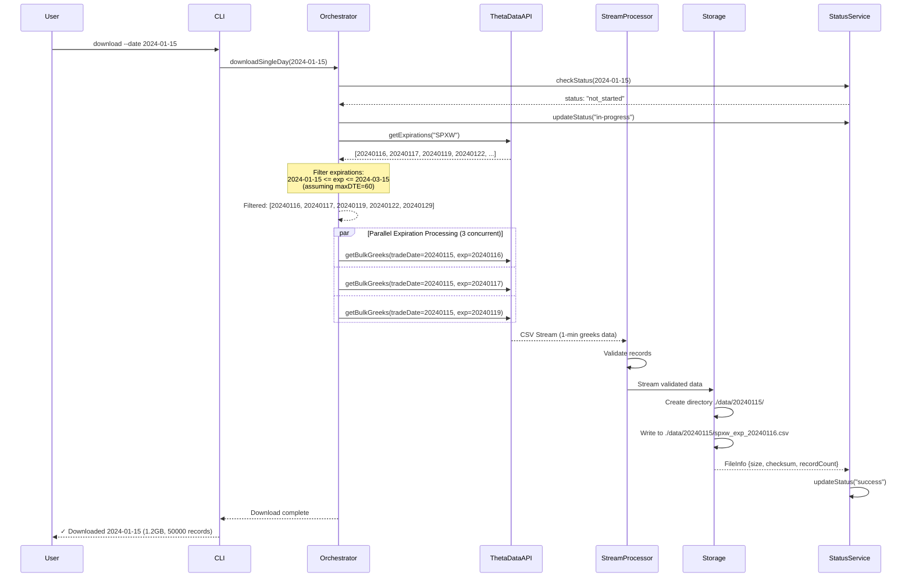
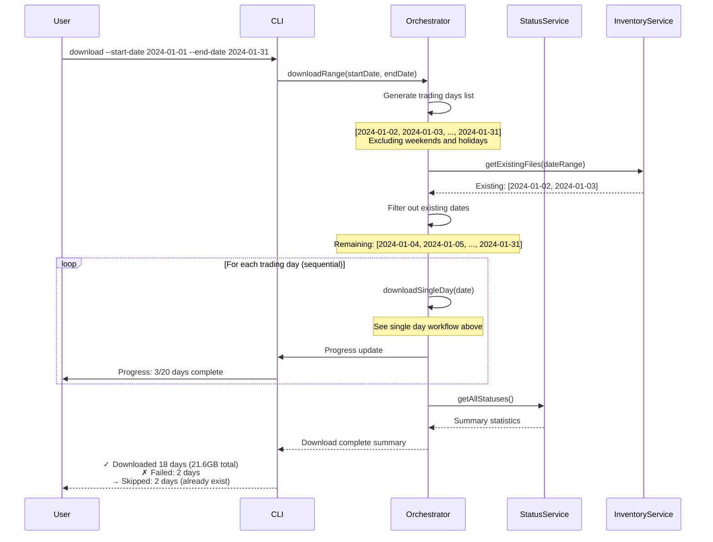
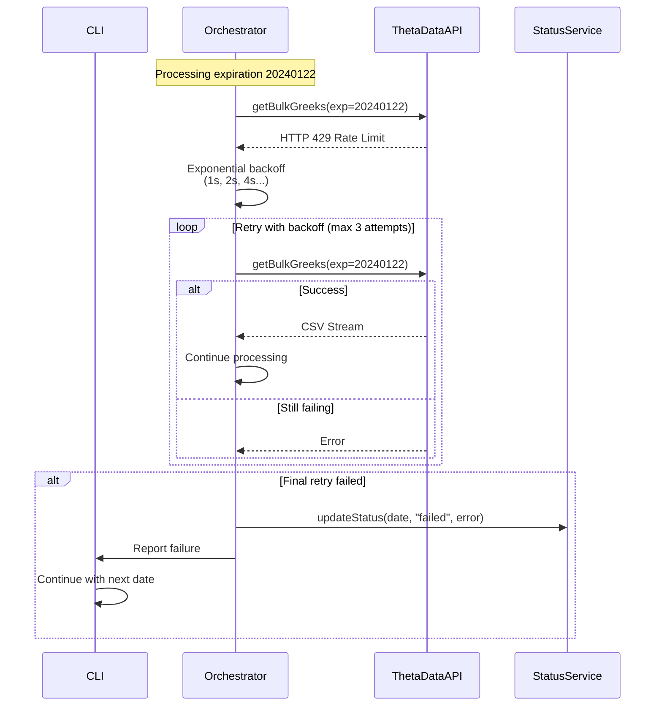
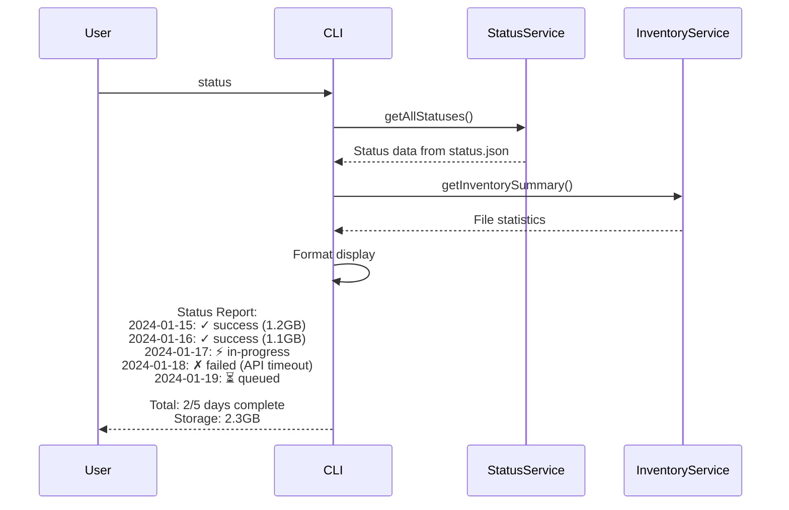
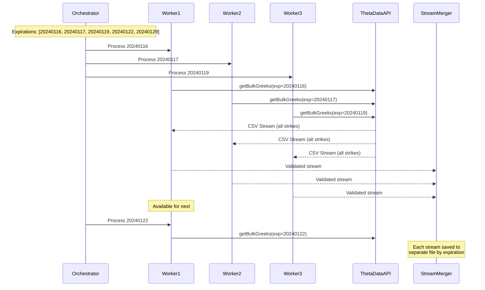

# Core Workflows

## Download Single Day Workflow

```mermaid
sequenceDiagram
    participant User
    participant CLI
    participant Orchestrator
    participant ThetaDataAPI
    participant StreamProcessor
    participant Storage
    participant StatusService
    
    User->>CLI: download --date 2024-01-15
    CLI->>Orchestrator: downloadSingleDay(2024-01-15)
    
    Orchestrator->>StatusService: checkStatus(2024-01-15)
    StatusService-->>Orchestrator: status: "not_started"
    
    Orchestrator->>StatusService: updateStatus("in-progress")
    
    Orchestrator->>ThetaDataAPI: getExpirations("SPXW")
    ThetaDataAPI-->>Orchestrator: [20240116, 20240117, 20240119, 20240122, ...]
    
    Note over Orchestrator: Filter expirations:<br/>2024-01-15 <= exp <= 2024-03-15<br/>(assuming maxDTE=60)
    
    Orchestrator-->>Orchestrator: Filtered: [20240116, 20240117, 20240119, 20240122, 20240129]
    
    par Parallel Expiration Processing (3 concurrent)
        Orchestrator->>ThetaDataAPI: getBulkGreeks(tradeDate=20240115, exp=20240116)
        and
        Orchestrator->>ThetaDataAPI: getBulkGreeks(tradeDate=20240115, exp=20240117)
        and
        Orchestrator->>ThetaDataAPI: getBulkGreeks(tradeDate=20240115, exp=20240119)
    end
    
    ThetaDataAPI-->>StreamProcessor: CSV Stream (1-min greeks data)
    StreamProcessor->>StreamProcessor: Validate records
    StreamProcessor->>Storage: Stream validated data
    
    Storage->>Storage: Create directory ./data/20240115/
    Storage->>Storage: Write to ./data/20240115/spxw_exp_20240116.csv
    
    Storage-->>StatusService: FileInfo {size, checksum, recordCount}
    StatusService->>StatusService: updateStatus("success")
    
    Orchestrator-->>CLI: Download complete
    CLI-->>User: ✓ Downloaded 2024-01-15 (1.2GB, 50000 records)
```

## Date Range Download Workflow

```mermaid
sequenceDiagram
    participant User
    participant CLI
    participant Orchestrator
    participant StatusService
    participant InventoryService
    
    User->>CLI: download --start-date 2024-01-01 --end-date 2024-01-31
    CLI->>Orchestrator: downloadRange(startDate, endDate)
    
    Orchestrator->>Orchestrator: Generate trading days list
    Note over Orchestrator: [2024-01-02, 2024-01-03, ..., 2024-01-31]<br/>Excluding weekends and holidays
    
    Orchestrator->>InventoryService: getExistingFiles(dateRange)
    InventoryService-->>Orchestrator: Existing: [2024-01-02, 2024-01-03]
    
    Orchestrator->>Orchestrator: Filter out existing dates
    Note over Orchestrator: Remaining: [2024-01-04, 2024-01-05, ..., 2024-01-31]
    
    loop For each trading day (sequential)
        Orchestrator->>Orchestrator: downloadSingleDay(date)
        Note over Orchestrator: See single day workflow above
        Orchestrator->>CLI: Progress update
        CLI->>User: Progress: 3/20 days complete
    end
    
    Orchestrator->>StatusService: getAllStatuses()
    StatusService-->>Orchestrator: Summary statistics
    
    Orchestrator-->>CLI: Download complete summary
    CLI-->>User: ✓ Downloaded 18 days (21.6GB total)<br/>✗ Failed: 2 days<br/>→ Skipped: 2 days (already exist)
```

## Error Recovery Workflow

```mermaid
sequenceDiagram
    participant CLI
    participant Orchestrator
    participant ThetaDataAPI
    participant StatusService
    
    Note over Orchestrator: Processing expiration 20240122
    
    Orchestrator->>ThetaDataAPI: getBulkGreeks(exp=20240122)
    ThetaDataAPI-->>Orchestrator: HTTP 429 Rate Limit
    
    Orchestrator->>Orchestrator: Exponential backoff<br/>(1s, 2s, 4s...)
    
    loop Retry with backoff (max 3 attempts)
        Orchestrator->>ThetaDataAPI: getBulkGreeks(exp=20240122)
        alt Success
            ThetaDataAPI-->>Orchestrator: CSV Stream
            Orchestrator->>Orchestrator: Continue processing
        else Still failing
            ThetaDataAPI-->>Orchestrator: Error
        end
    end
    
    alt Final retry failed
        Orchestrator->>StatusService: updateStatus(date, "failed", error)
        Orchestrator->>CLI: Report failure
        CLI->>CLI: Continue with next date
    end
```

## Status Check Workflow

```mermaid
sequenceDiagram
    participant User
    participant CLI
    participant StatusService
    participant InventoryService
    
    User->>CLI: status
    CLI->>StatusService: getAllStatuses()
    StatusService-->>CLI: Status data from status.json
    
    CLI->>InventoryService: getInventorySummary()
    InventoryService-->>CLI: File statistics
    
    CLI->>CLI: Format display
    
    CLI-->>User: Status Report:<br/>2024-01-15: ✓ success (1.2GB)<br/>2024-01-16: ✓ success (1.1GB)<br/>2024-01-17: ⚡ in-progress<br/>2024-01-18: ✗ failed (API timeout)<br/>2024-01-19: ⏳ queued<br/><br/>Total: 2/5 days complete<br/>Storage: 2.3GB
```

## Parallel Expiration Processing Detail

```mermaid
sequenceDiagram
    participant Orchestrator
    participant Worker1
    participant Worker2
    participant Worker3
    participant ThetaDataAPI
    participant StreamMerger
    
    Note over Orchestrator: Expirations: [20240116, 20240117, 20240119, 20240122, 20240129]
    
    Orchestrator->>Worker1: Process 20240116
    Orchestrator->>Worker2: Process 20240117
    Orchestrator->>Worker3: Process 20240119
    
    Worker1->>ThetaDataAPI: getBulkGreeks(exp=20240116)
    Worker2->>ThetaDataAPI: getBulkGreeks(exp=20240117)
    Worker3->>ThetaDataAPI: getBulkGreeks(exp=20240119)
    
    ThetaDataAPI-->>Worker1: CSV Stream (all strikes)
    ThetaDataAPI-->>Worker2: CSV Stream (all strikes)
    ThetaDataAPI-->>Worker3: CSV Stream (all strikes)
    
    Worker1-->>StreamMerger: Validated stream
    Worker2-->>StreamMerger: Validated stream
    Worker3-->>StreamMerger: Validated stream
    
    Note over Worker1: Available for next
    Orchestrator->>Worker1: Process 20240122
    Worker1->>ThetaDataAPI: getBulkGreeks(exp=20240122)
    
    Note over StreamMerger: Each stream saved to<br/>separate file by expiration
```
