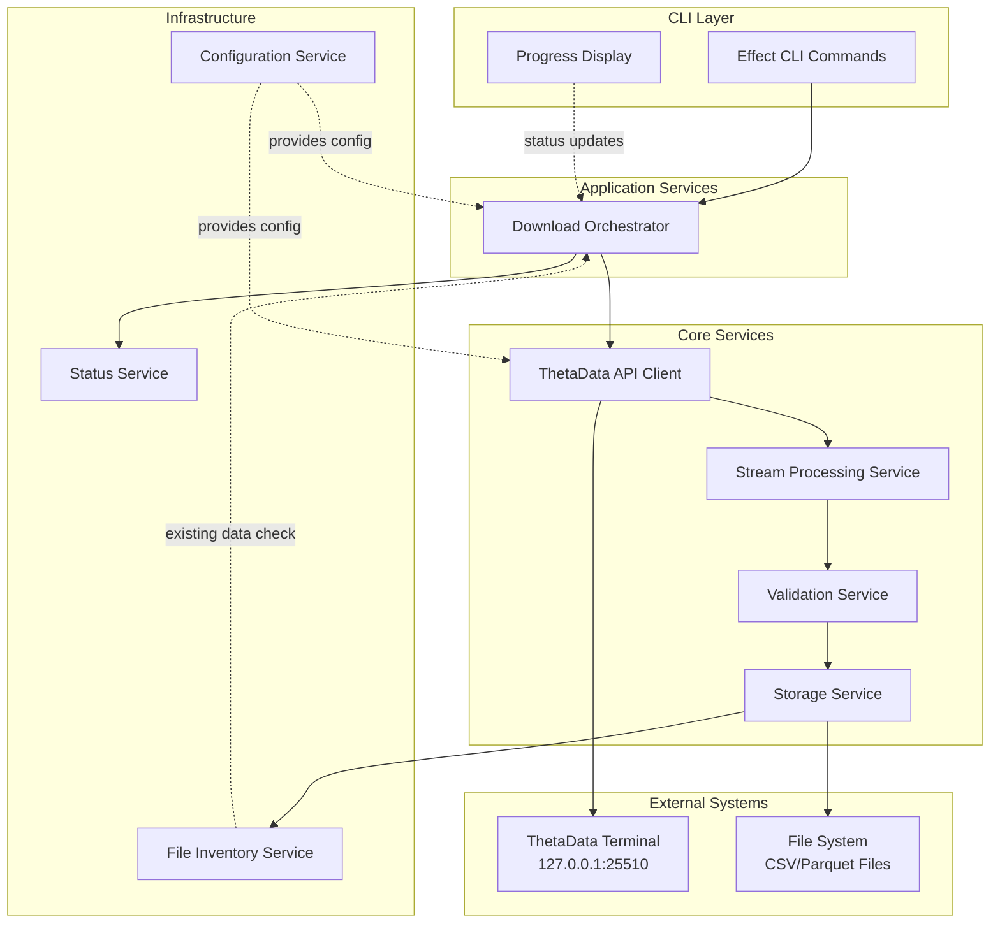

# High Level Architecture

## Technical Summary

The SPX Options Data Pipeline Tool will be built as a streaming CLI application using Effect-TS with Bun runtime, implementing a service-oriented architecture with expiration-based parallelization. The system processes SPX options data from ThetaData's local terminal API through memory-efficient Effect Streams, validates data integrity, and stores results as compressed Parquet files. Core architectural patterns include Context.Tag-based dependency injection, tagged error handling, and comprehensive test layers following strict TDD practices.

## High Level Overview

**Architectural Style:** Service-Oriented CLI Application with Streaming Pipeline

**Repository Structure:** Monorepo (as specified in PRD)
- Single repository containing all modules with clear separation
- `/packages/core` - Core business logic and services
- `/packages/cli` - CLI commands and interface
- `/packages/api-client` - ThetaData API integration

**Service Architecture:** Effect-TS Service Layer Architecture
- Context.Tag for service identification
- Layer composition for dependency injection
- Separate Live and Test implementations for all services
- Tagged errors for type-safe error handling

**Primary Data Flow:**
1. CLI command triggers download for date range
2. ThetaDataApiClient fetches available SPXW expirations
3. Filter expirations by trade date + maxDTE configuration
4. Parallel requests for bulk greeks data (2-4 concurrent)
5. Stream pipeline processes CSV data with <75% memory usage
6. ValidationService ensures data integrity
7. StorageService writes to trade date directories
8. Progress tracking provides real-time feedback

**Key Architectural Decisions:**
- **Bun over Node.js** - Better performance, native SQLite support, faster startup
- **Effect Streams** - Memory-efficient processing of 50K+ records/minute
- **Expiration-based parallelization** - Optimal balance between speed and API limits
- **Parquet storage** - 5:1 compression ratio and 10x query performance
- **Service layer pattern** - Clean separation of concerns and testability

## High Level Project Diagram

## Architectural and Design Patterns

- **Service-Oriented Architecture (Effect-TS):** Using Context.Tag pattern for all services with Layer composition - *Rationale:* Enforces clean separation of concerns, enables dependency injection, and simplifies testing with Test layers
- **Streaming Pipeline Pattern:** Effect Streams for continuous data processing - *Rationale:* Prevents memory overflow when processing years of data, handles 50K+ records/minute efficiently
- **Expiration-Based Processing:** Parallel processing grouped by expiration dates - *Rationale:* Simplifies architecture while maximizing throughput within API rate limits
- **Command Pattern (Effect CLI):** Structured CLI commands with Options and Args - *Rationale:* Provides intuitive interface for quant researchers, supports complex operations with simple commands
- **Repository Pattern:** Abstract data access for file operations - *Rationale:* Enables testing with in-memory implementations and future storage flexibility
- **Circuit Breaker Pattern:** For ThetaData API resilience - *Rationale:* Prevents cascading failures and manages API availability gracefully
- **Dependency Injection (Effect Layers):** Layer composition for all dependencies - *Rationale:* Facilitates testing, configuration management, and environment-specific implementations
